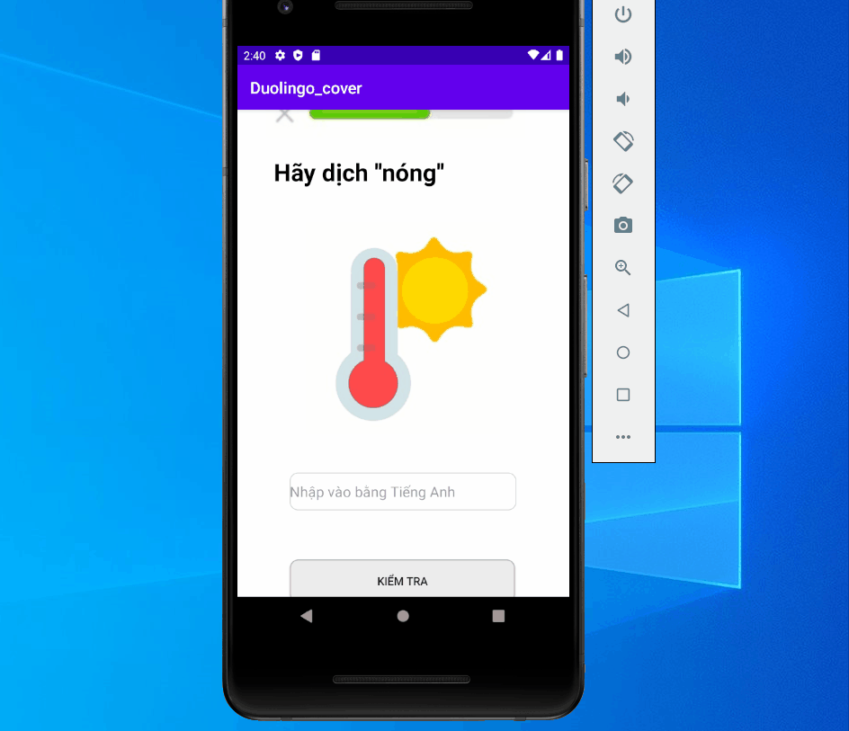

# Nhóm 23: Ứng dụng học Tiếng Anh
1. Thông tin chung:
* Lớp môn học: Lập trình cho thiết bị di động
* Giảng viên: PGS.TS Trương Anh Hoàng
* Thông tin các thành viên:
  * Ngô Quang Huy: 18020628
  * Nguyễn Viết Huy Khôi: 18020719
  * Trần Thanh Hương: 18020619
 
2. Thông tin ứng dụng:
* Dưới đây là ảnh động test tính năng mà nhóm hiện có, dự kiến sẽ hoàn thiện hơn nữa sau:

# TranThanhHuong 

# NgoQuangHuy 

# NguyenVietHuyKhoi 

